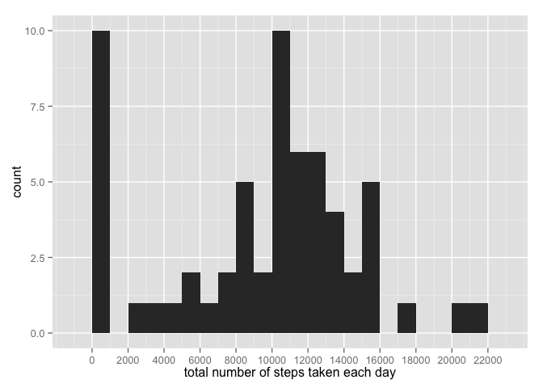
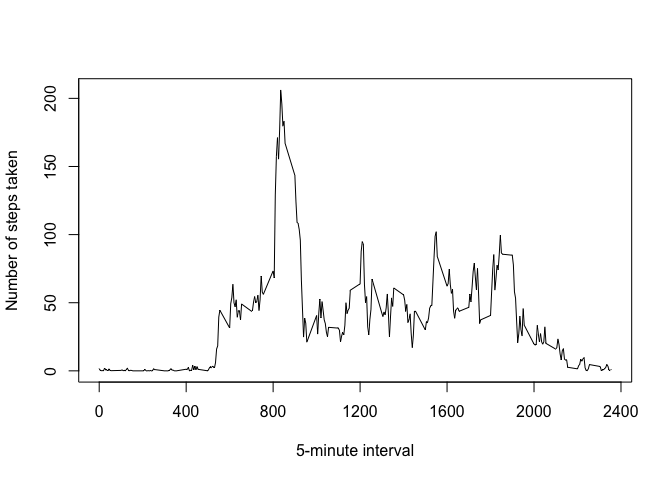
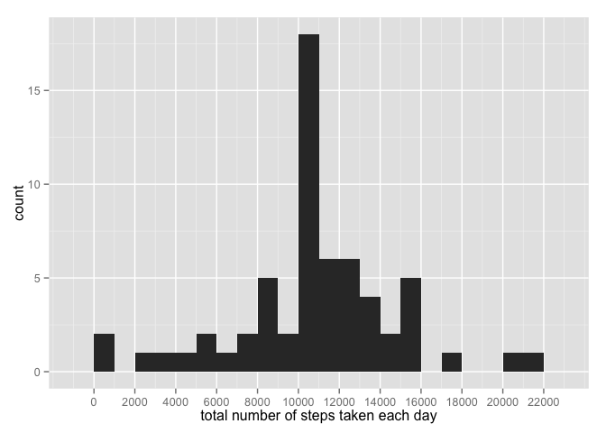
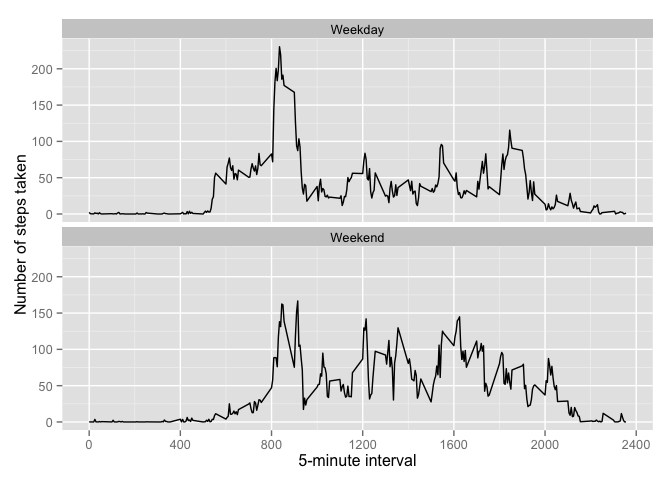

# Reproducible Research: Peer Assessment 1


## Loading and preprocessing the data

```r
data <- read.csv(unz("activity.zip", "activity.csv"), sep=",", header=TRUE, na.strings = "NA", stringsAsFactors=FALSE)
#cast the date
data$date <- as.Date(data$date, format="%Y-%m-%d")
```


## What is mean total number of steps taken per day?

```r
library(ggplot2)
total.steps <-aggregate(x = list(steps = data$steps), by = list(date = data$date), FUN = sum, na.rm = TRUE)
colnames(total.steps) <- c("date", "steps")

p <- qplot(total.steps$steps, geom="histogram", binwidth = 1000) 
p <- p +  xlab("total number of steps taken each day")
p <- p + scale_x_continuous(breaks=seq(0,22000,by=2000)) 
p
```

 

```r
mean(total.steps$steps, na.rm=TRUE)
```

```
## [1] 9354.23
```

```r
median(total.steps$steps, na.rm=TRUE)
```

```
## [1] 10395
```


## What is the average daily activity pattern?

```r
library(ggplot2)
averages <- aggregate(x = list(steps = data$steps), by = list(interval = data$interval), FUN = mean, na.rm = TRUE)

plot(averages$steps~averages$interval, type="l", ylab="Number of steps taken", xlab="5-minute interval", axes = FALSE)
axis(side=1, at=seq(0, 2400, by=400))
axis(side=2, at=seq(0, 250, by=50))
box()
```

 

Which 5-minute interval, on average across all the days in the dataset, contains the maximum number of steps?

```r
averages[which.max(averages$steps), ]
```

```
##     interval    steps
## 104      835 206.1698
```


## Imputing missing values
Total number of missing values in the dataset?

```r
data.na <- is.na(data$steps)
table(data.na)
```

```
## data.na
## FALSE  TRUE 
## 15264  2304
```

Replace each missing values with the mean value of the 5-minute interval

```r
filled.data <- data
get.5min.interval.mean <- function (steps, interval) {
        mean.steps <- c(steps)
        if(is.na(steps)) 
                mean.steps <- averages[averages$interval == interval, "steps"]
        mean.steps
}

filled.data$steps <- mapply(get.5min.interval.mean, filled.data$steps, filled.data$interval)
```


```r
library(ggplot2)
total.steps <-aggregate(x = list(steps = filled.data$steps), by = list(date = filled.data$date), FUN = sum, na.rm = TRUE)
colnames(total.steps) <- c("date", "steps")

p <- qplot(total.steps$steps, geom="histogram", binwidth = 1000) 
p <- p +  xlab("total number of steps taken each day")
p <- p + scale_x_continuous(breaks=seq(0,22000,by=2000))
p
```

 


```r
mean(total.steps$steps)
```

```
## [1] 10766.19
```


```r
median(total.steps$steps)
```

```
## [1] 10766.19
```

The **mean** and **median** values have increased compared to the first part of the assignment.  The reason for the improvement is that the **NA** values for steps have been replaced by the average steps of the same interval.  

## Are there differences in activity patterns between weekdays and weekends?


```r
weekend.or.weekday.data <- filled.data

weekend.or.weekday <- function(day) {
        weekend.or.weekday <- NA
        if(day %in% c("Saturday", "Sunday")) 
                weekend.or.weekday <- "Weekend"
        else if(day %in% c("Monday", "Tuesday", "Wednesday", "Thursday", "Friday"))
                weekend.or.weekday <- "Weekday"
        else
                weekend.or.weekday <- NA
        
        weekend.or.weekday
}

weekend.or.weekday.data$day <- sapply(FUN=weekend.or.weekday, weekdays(weekend.or.weekday.data$date))
```


```r
library(ggplot2)
averages <- aggregate(x = list(steps = weekend.or.weekday.data$steps), by = list(interval = weekend.or.weekday.data$interval, day = weekend.or.weekday.data$day), FUN = mean, na.rm = TRUE)
p <- ggplot(averages, aes(interval, steps)) 
p <- p + geom_line() + facet_wrap(~day, ncol=1) 
p <- p + ylab("Number of steps taken") + xlab("5-minute interval")
p <- p + scale_x_continuous(breaks=seq(0,2400,by=400)) 
p
```

 

